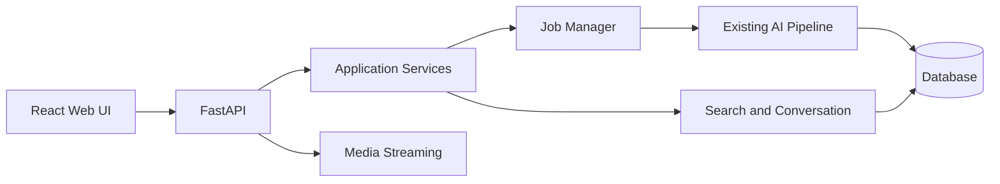

# Web UI 遷移設計與開發規格

> **類型**：原始需求 prompt｜**狀態**：使用者交付的規格原文，唯讀不改
> 分類說明與完整索引見 [`README.md`](README.md)。

> 本文件供 Claude Code 閱讀與執行。請先完成 Phase 0 架構盤點並輸出分析報告，取得確認後再修改程式碼。

## 1. 目標與範圍

將目前 Tkinter UI 遷移為 Web UI，同時保留既有影片處理、搜尋、對話搜尋、資料庫與成本統計功能。

來源文件：`07-ui-structure-and-features.md`。

主要目標：

- 使用瀏覽器完成影片上傳、YouTube 下載、分析與搜尋。
- 顯示長時間任務的階段、進度、錯誤與重試狀態。
- 使用 HTML5 Video 播放影片並跳轉至搜尋片段時間點。
- 保留單次搜尋與多輪對話搜尋兩個獨立入口。
- 將 UI、Application Service 與 AI Pipeline 明確分層。
- Web UI 功能穩定前保留 Tkinter，避免一次性替換造成回歸。

非目標：

- 不重新設計 ASR、VLM、OCR、Embedding 或搜尋演算法。
- 不大幅重構既有 Pipeline。
- 第一版不強制導入微服務、Kubernetes 或複雜權限系統。

## 2. 技術選型

| 層級 | 建議技術 | 用途 |
|---|---|---|
| Frontend | React + TypeScript + Vite | Web UI 與互動狀態 |
| UI | Tailwind CSS + shadcn/ui | 元件與一致的設計系統 |
| Server State | TanStack Query | API Cache、重新整理與失效控制 |
| Backend | FastAPI + Pydantic | REST API、驗證與服務協調 |
| Background Job | POC：現有 Thread／Executor | 保留既有執行模式並建立 Job 狀態 |
| Production Job | Dramatiq 或 Celery + Redis | 任務佇列、重試與多 Worker |
| Progress | POC：Polling；進階：SSE | 任務與 Log 進度更新 |
| Database | 沿用現有 DB | 先避免同時遷移資料庫 |

第一版優先使用 Polling，不要為了即時更新過早導入 WebSocket。Polling 能在瀏覽器重新整理或暫時斷線後自然恢復。

## 3. 目標架構



責任邊界：

- React：顯示、表單、篩選、播放器與頁面狀態。
- FastAPI：輸入驗證、錯誤轉換、API 與服務協調。
- Application Services：封裝目前 Tkinter Event Handler 的應用流程。
- Job Manager：保存任務狀態、進度、錯誤、重試與取消。
- Pipeline：保留下載、分析、摘要與搜尋核心邏輯。
- Database：作為跨請求、跨頁面狀態的單一事實來源。
- Media Streaming：提供影片與縮圖，不暴露伺服器實體路徑。

Tkinter 邏輯遷移原則：

| Tkinter 現況 | Web 對應 |
|---|---|
| `threading.Thread + queue + after()` | Job Manager + Polling／SSE |
| `ffplay` | HTML5 Video + HTTP Range |
| `filedialog` | Browser Multipart Upload |
| `messagebox` | Dialog／Toast + API Error |
| `ttk.Notebook` | Web Router + Sidebar |
| `Treeview` | Data Table |
| Callback 刷新其他頁籤 | Query Cache Invalidation |
| 記憶體 `deque` Log | Log Store + Log API |

## 4. 建議專案結構

先依現有專案實際結構調整，不要未盤點就強制搬移所有檔案。

```text
project/
├── backend/
│   ├── api/
│   │   ├── videos.py
│   │   ├── jobs.py
│   │   ├── search.py
│   │   ├── conversations.py
│   │   ├── logs.py
│   │   └── stats.py
│   ├── schemas/
│   ├── services/
│   │   ├── video_service.py
│   │   ├── analysis_service.py
│   │   ├── search_service.py
│   │   ├── conversation_service.py
│   │   └── stats_service.py
│   └── main.py
├── frontend/
│   ├── src/
│   │   ├── api/
│   │   ├── components/
│   │   ├── features/
│   │   ├── pages/
│   │   ├── routes/
│   │   └── types/
│   └── package.json
└── src/
    └── existing_pipeline/
```

注意：`src/ai_video_search_web` 目前實際包含 Tkinter，不要立即重新命名。待 Web UI 通過驗收後，再另行規劃命名調整。

## 5. 頁面與功能設計

### 5.1 全域 Layout

使用 Sidebar 或 Top Navigation：

```text
影片與分析
影片庫
搜尋結果
對話搜尋
處理任務
系統紀錄
```

Header 保留四項統計：

- 待分析。
- 已分析。
- 影片片段。
- 累計成本。

由 `GET /api/v1/stats` 取得，不在前端自行計算。

### 5.2 影片與分析 `/videos/upload`

功能：

- YouTube URL 輸入、格式驗證與重複檢查。
- 本機 MP4／MOV／MKV／WebM 上傳。
- 顯示下載或上傳進度。
- 待分析影片清單與多選分析。
- 顯示影片長度上限檢查結果。
- 移除影片前使用確認 Dialog。
- 顯示任務階段、百分比與錯誤。

Browser 只能上傳檔案內容，不能把使用者本機路徑交給後端使用。

### 5.3 影片庫 `/videos`

保留現有功能：

- 全部、分析完成、分析失敗、無字幕、純畫面篩選。
- 影片名稱、片段數、成本與分析日期排序。
- 縮圖、摘要及 ASR／VLM／OCR Badge。
- 重新產生摘要。
- 在此影片內搜尋。
- 重新分析。

改善：縮圖應在影片匯入或分析時產生並保存，不要每次開啟詳細資料才執行 FFmpeg。

### 5.4 搜尋結果 `/search`

功能：

- 全影片或指定影片搜尋。
- 顯示排名、時間區間、相似度、融合分數與命中來源。
- 顯示 Transcript、Visual、OCR 等各模態分數。
- 點擊結果時讓影片跳到 `start_sec`。
- 支援播放片段與 CSV 匯出。
- 保留最近搜尋。

共用結果型別：

```text
result_id
video_id
video_title
start_sec
end_sec
similarity
fusion_score
matched_sources
description
transcript
```

### 5.5 對話搜尋 `/chat`

保留 `ConversationState` 與 `conversation_pipeline.handle_turn()` 的既有行為。

- 顯示多輪訊息。
- 顯示本輪相關影片片段。
- 支援「第二段」「上一個結果」等指代。
- 與單次搜尋共用 Result Card 與 Video Player。
- LLM 回答必須可追溯至實際影片與時間點。
- 沒有足夠證據時明確回覆找不到。

### 5.6 任務與紀錄 `/jobs`、`/logs`

`/jobs` 顯示使用者可理解的處理進度：

```text
等待中 → 下載／上傳 → 音訊抽取 → ASR → 場景分析
→ VLM／OCR → Embedding → 寫入索引 → 完成
```

`/logs` 保留：

- INFO／WARNING／ERROR 篩選。
- 影片名稱與 Pipeline Stage。
- 完整 traceback。
- 清除畫面、複製錯誤與 CSV 匯出。

Production 不要只使用 `deque(maxlen=1000)` 作為唯一 Log 來源。

## 6. API 設計

```text
GET    /api/v1/stats

POST   /api/v1/videos/upload
POST   /api/v1/videos/youtube
GET    /api/v1/videos
GET    /api/v1/videos/{video_id}
DELETE /api/v1/videos/{video_id}

POST   /api/v1/videos/{video_id}/analyze
POST   /api/v1/videos/{video_id}/reanalyze
POST   /api/v1/videos/{video_id}/summary
GET    /api/v1/videos/{video_id}/stream
GET    /api/v1/videos/{video_id}/thumbnail

GET    /api/v1/jobs
GET    /api/v1/jobs/{job_id}
POST   /api/v1/jobs/{job_id}/retry

POST   /api/v1/search
GET    /api/v1/search/recent

POST   /api/v1/conversations
GET    /api/v1/conversations/{conversation_id}
POST   /api/v1/conversations/{conversation_id}/messages

GET    /api/v1/logs
GET    /api/v1/logs/export
```

> **這是遷移設計階段的規劃清單，不是現況。** 實際出貨與這份清單的差異：
> `POST /api/v1/search/export`（CSV 匯出）曾經實作、之後隨前端功能一起移除
> （見 `11-web-ui-warm-redesign-plan.md` §8.13）；`GET /api/v1/search/recent`
> 與 `GET /api/v1/logs`、`GET /api/v1/logs/export` 從未實作。另外實際多了
> `GET /api/v1/youtube/search`（YouTube 搜尋頁）。現況以程式碼與
> `http://127.0.0.1:8000/docs` 的 OpenAPI 為準。

API 統一回傳穩定的 Error Schema：

```json
{
  "error": {
    "code": "VIDEO_NOT_FOUND",
    "message": "找不到指定影片",
    "details": null
  }
}
```

影片串流必須支援 HTTP Range Request，確保 HTML5 Video 能跳轉時間點。

## 7. Job 狀態設計

建議新增或等價保存：

```text
processing_jobs
├── id
├── video_id
├── job_type
├── status
├── current_stage
├── progress_percent
├── progress_message
├── error_code
├── error_message
├── created_at
├── started_at
└── completed_at
```

狀態：

```text
queued
running
completed
failed
retrying
cancelled
```

要求：

- 瀏覽器重新整理後仍能讀到任務狀態。
- 多個任務不可共用同一個可變全域狀態。
- Pipeline 例外必須轉成可保存的 Job Error。
- 失敗任務保留錯誤資訊並可安全重試。

## 8. Web 設計系統

延用目前視覺規則：

```text
App Background  #F5F7FA
Card Background #FFFFFF
Primary Text    #172033
Secondary Text  #667085
Primary         #2563EB
Primary Hover   #1D4ED8
Success         #16A34A
Warning         #D97706
Error           #DC2626
Border          #D0D5DD
Selected Row    #E8F1FF
```

其他規則：

- 延用 8px 間距系統。
- Badge 必須同時顯示文字，不只依賴顏色。
- 相似度同時顯示色條與百分比。
- 桌面優先，但最低支援平板寬度；資料表在窄畫面可水平捲動。
- 所有表單元件需有 Label、Focus 狀態與錯誤訊息。
- Loading、Empty、Error、Success 狀態均需明確設計。

## 9. 遷移計畫

### Phase 0：盤點，不修改程式

- 列出所有 Tkinter Event Handler。
- 建立「UI 事件 → 現有函式 → Service → API」對照表。
- 找出 UI、DB 與 Pipeline 混合的函式。
- 盤點全域狀態、Thread、Queue、Callback 與暫存檔。
- 確認現有 DB 是否能支援 Job 與 Conversation。
- 提出最小變更方案、受影響檔案、測試與回滾方式。

### Phase 1：抽離 Application Service

- 建立 Video、Analysis、Search、Conversation、Stats Service。
- 不改變 Pipeline 的輸入、輸出與搜尋結果。
- Tkinter 暫時改用同一組 Service，驗證行為未改變。

### Phase 2：建立 FastAPI

- 實作 Schema、API、Job 狀態與 Media Streaming。
- 使用 API Test 與 Swagger 驗證，不急著建立全部前端。
- 將例外轉成穩定 Error Code，不直接回傳 traceback。

### Phase 3：建立 React UI

依風險由低至高遷移：

```text
Header 統計
→ 影片庫
→ 單次搜尋與播放器
→ 影片上傳與分析任務
→ 對話搜尋
→ 處理紀錄
```

### Phase 4：切換與清理

- 完成功能對等與 Regression Test。
- Web UI 穩定前保留 Tkinter。
- 確認不再需要回滾後，才移除 Tkinter 專用程式。
- 最後再處理 `ai_video_search_web` 命名問題。
- 同步更新 `00-overview.md`，補上已存在的對話搜尋。

## 10. 驗收標準

- 本機上傳與 YouTube 下載結果和 Tkinter 版本一致。
- 分析產生的 Segment、摘要、成本與狀態一致。
- 搜尋排名、分數、命中來源及時間點一致。
- 指定搜尋結果可跳轉並播放正確影片時間。
- 對話搜尋能保存與更新 Conversation State。
- 重新整理瀏覽器不會遺失任務狀態。
- 同時執行多個任務不會互相覆蓋。
- 失敗任務能顯示錯誤、保留紀錄並安全重試。
- 影片刪除、重新分析與摘要重建均有確認與錯誤處理。
- Tkinter 現有 Pipeline Regression Test 全部通過。
- API 具備單元測試與整合測試。
- 前端至少涵蓋主要 User Flow 的 Component／E2E Test。

## 11. 安全與 Production 考量

- 驗證上傳副檔名、MIME、檔案大小與實際影片格式。
- 使用系統產生的檔名，避免 Path Traversal 與覆蓋檔案。
- 不向前端回傳伺服器實體路徑。
- YouTube URL、搜尋 Query 與篩選參數均需驗證。
- CORS 僅允許設定的 Frontend Origin。
- Production 加入身分驗證、影片所有權、Rate Limit 與 Audit Log。
- FFmpeg／ffprobe 執行參數不可直接拼接未驗證的使用者輸入。

## 12. Claude Code 首次執行指令

第一階段只進行分析，不要修改程式碼、資料庫或既有文件。

請先閱讀：

- `07-ui-structure-and-features.md`。
- `src/ai_video_search_web/app.py`。
- `src/ai_video_search_web/theme.py`。
- `src/ai_video_search_web/ui/`。
- 現有 Pipeline、Database 與測試程式。

輸出以下內容：

1. 實際專案結構與資料流。
2. Tkinter Event Handler 對照表。
3. 可直接重用與必須解耦的模組。
4. 建議新增或修改的檔案清單。
5. API、Schema 與 Job State 草案。
6. 分階段實作順序與每階段驗收條件。
7. 相容性、資料遷移、安全與回滾風險。
8. 文件內容與實際程式碼的差異。

遇到不確定資訊請標記為「待確認」，不要自行假設。完成 Phase 0 後等待確認，再開始實作。
